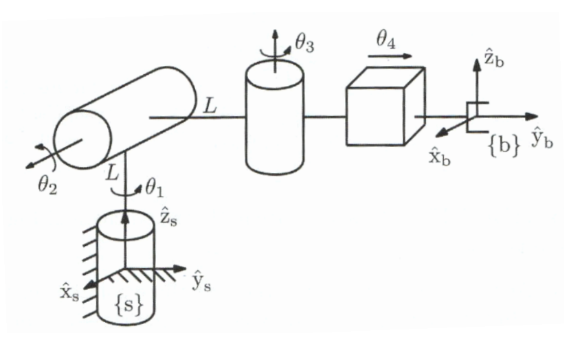
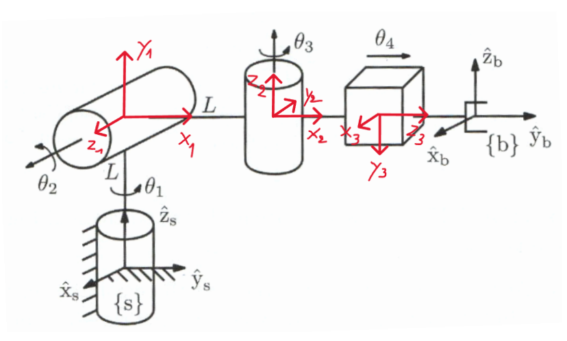
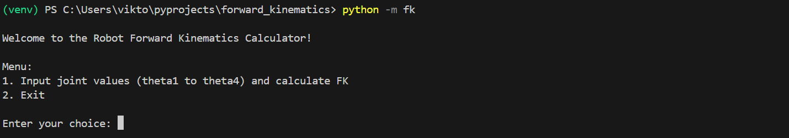
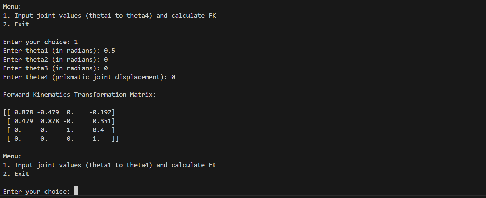
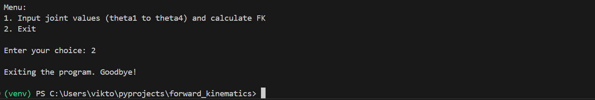
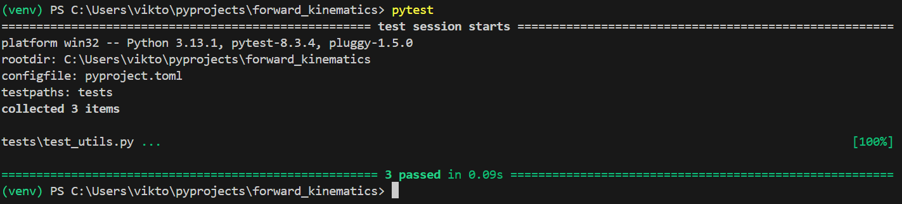

# forward_kinematics
## Table of Contents
1. [About the Project](#about-the-project)
2. [Documentation](#documentation)
3. [Project Structure](#project-structure)
4. [Installation](#installation)
   - [Prerequisites](#prerequisites)
   - [Setup Instructions](#setup-instructions)
5. [Run the Project Locally](#run-the-project-locally)
6. [Usage and Examples](#usage-and-examples)
7. [Running Tests](#running-tests)
8. [License](#license)
9. [Acknowledgements](#acknowledgements)
10. [Authors and Contact](#authors-and-contact)
11. [Badges](#badges)

## About the Project
This repository demonstrates how to perform Forward Kinematics (FK) using a specific kinematic chain example.

The kinematic chain used in this project is illustrated below:

<p align="center">
  
</p>

With the intermediate Denavit Hartenberg (DH) reference frames added, we get the following sketch:

<p align="center">
  
</p>

From this, we determine the DH parameters:

| Link | a (m)   | d (m)   | alpha (rad)   | theta (rad)         |
|------|---------|---------|---------------|---------------------|
| 1    | 0       | 0.4     | π/2           | θ₁ + π/2            |
| 2    | 0.4     | 0       | -π/2          | θ₂                  |
| 3    | 0       | 0       | -π/2          | θ₃ - π/2            |
| 4    | 0       | θ₄      | π/2           | 0                   |


The homogeneous transform between two reference frames is given by: 

```math
T_{i}^{i+1} = 
\begin{bmatrix}
\cos(\theta) & -\sin(\theta)\cos(\alpha) & \sin(\theta)\sin(\alpha) & a\cos(\theta) \\
\sin(\theta) & \cos(\theta)\cos(\alpha) & -\cos(\theta)\sin(\alpha) & a\sin(\theta) \\
0 & \sin(\alpha) & \cos(\alpha) & d \\
0 & 0 & 0 & 1
\end{bmatrix}
```

The complete homogeneous transformation between the base of the robot and the robot TCP is then given by:

```math
T_{base}^{TCP} = T_{0}^{1} \cdot T_{1}^{2} \cdot T_{2}^{3} \cdot T_{3}^{4}
```

*Note:* Here we used the classical Denavit Hartenberg convention, one could also use the modified DH convention. 

## Documentation
Documentation can be downloaded from the  [`docs/`](docs/) folder. 

## Project Structure
The project is organized as follows:

```bash
forward_kinematics/
├── docs/                       # Documentation folder
├── res/                        # Resources folder
├── src/                        # Source code folder
│   ├── fk/                     # Primary package for the project
│   │   ├── __init__.py         # Makes this a regular package
│   │   ├── __main__.py         # Entry point for the application
│   │   └── utils.py            # A module file
├── tests/                      # Unit tests for the project
│   └── test_utils.py
├── .gitignore                  # Specifies files and folders to ignore in version control
├── LICENSE                     # License file specifying the project's terms of use
├── pyproject.toml              # Configuration for packaging and installation 
├── README.md                   # Project documentation and overview
└── requirements.txt            # List of dependencies required for the project
```

## Installation
### Prerequisites
- Git (install the latest version of Git [here](https://git-scm.com/downloads))
- Python 3.8 or higher (install the latest version of Python [here](https://www.python.org/downloads/))
- pip

### Setup Instructions
For installation on your local device, open a terminal and navigate to the desired directory to clone the project from GitHub. Then perform the following steps:

1. Clone the repository from GitHub to your local device:
   ```bash
   git clone https://github.com/ViktorLaurens/forward_kinematics.git
   ```

2. Navigate to the project directory:
   ```bash
   cd forward_kinematics
   ```

3. Create a virtual environment: 
   ```bash
   python -m venv venv
   ```

4. Activate the virtual environment:
   - For Windows: 
      ```bash
      .\venv\Scripts\Activate.ps1
      ```
   - For macOS/Linux:
      ```bash
      source venv/bin/activate
      ```

5. Install dependencies: 
   ```bash
   pip install -r requirements.txt
   ```

6. Install the project in editable mode:
   ```bash
   pip install -e .
   ```

*What does this do?* This command tells pip to run the `setup.py` or `pyproject.toml` in the project to configure the package. A symbolic link between the source code of your project (in the `src/` directory) and the Python environment is created. Any changes made to the code are immediately reflected without needing to reinstall the project.

*Note: For Windows users, if you're not authorized to run scripts, enable execution by running:*
   ```bash
   Set-ExecutionPolicy -Scope CurrentUser -ExecutionPolicy RemoteSigned
   ```

## Run the Project Locally
After installation, run the project using the following command:
```bash
python -m fk
```

## Usage and examples
When you run the command above in the terminal, you will be greeted with the following prompt:
 


The menu shows you the options you have. When wanting to calculate the homogeneous transform between base and end effector (TCP), enter 1 and afterwards enter the numerical values for each joint angle: 



You are asked to choose an option again. Entering 2 will stop the program: 



## Running Tests
To run the tests in the `tests/` folder, run the following command:

```bash
pytest
```

Running pytest in the terminal should output the following: 



## License
Distributed under the [MIT](https://choosealicense.com/licenses/mit/) License. See `LICENSE` for more information.

## Acknowledgements
- [NumPy](https://numpy.org/) - A powerful library for numerical computations in Python.
- [Denavit-Hartenberg Method](https://www.researchgate.net/publication/270576179_DIFFERENCE_BETWEEN_DENAVIT_-_HARTENBERG_D-H_CLASSICAL_AND_MODIFIED_CONVENTIONS_FOR_FORWARD_KINEMATICS_OF_ROBOTS_WITH_CASE_STUDY) - The foundation for kinematic modeling in robotics.


## Authors and Contact
- Developed by [@ViktorLaurens](https://github.com/ViktorLaurens/)
- Feel free to reach out via GitHub Issues or [email](mailto:viktor@example.com).

## Badges
[](https://www.python.org/)  
[](https://choosealicense.com/licenses/mit/)  
[](https://github.com/ViktorLaurens/forward_kinematics/actions)
[](https://github.com/ViktorLaurens/forward_kinematics)
